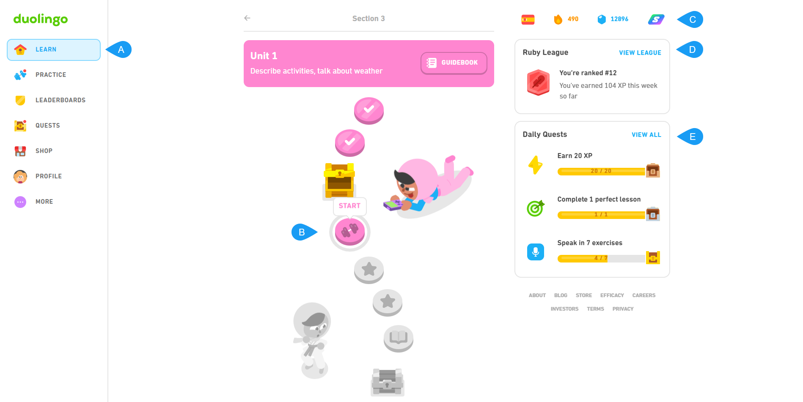

# Duolingo home page overview

A short concept topic that explains the core elements of the Duolingo web application home page.

## A. Main menu

The main menu contains elements such as:

| Element | Description |
| ----------- | ----------- |
| LEARN | Page of the current course |
| PRACTICE | Page for practicing mistakes, but also for repeated speaking, listening and storytelling |
| LEADERBOARDS | Page that summarizing the daily rankings of application users for the currently selected language |
| QUESTS | Page that contains challenges or tasks in which the user is currently participating |
| SHOP | On this page, the user can exchange the acquired gems for a.o.: the ability to freeze days without learning or to boost the hearts needed to continue playing |
| PROFILE | User profile contains individual statistics, friends and achievements |
| MORE | Dropdown that contains settings, help section and the ability to log out from the application |

## B. Learn section

Place that displays the user's journey in the current course. 
- Activities marked as **checked and colored** mean that they have been completed;
- **Chest** means a reward/surprise for the user. These could be gems, doubling user points count or free days of Super Duolingo;
- **Dumbbells** indicate the current practice;
- **Gray fields** indicate tasks that have not been started yet.
- **Book** means reading exercise.

## C. Top bar

The top bar menu contains elements such as:

| Element | Description |
| ----------- | ----------- |
| FLAG | indicates the selected language course |
| FIRE | means the number of days the user spent practicing a given language course |
| GEMS | means the number of obtained gems |
| Super Duolingo or HEARTS | here the user can find the Super Duolingo mark or the amount of remaining hearts to use |

## D. Legue view

A shortcut that moves to the Leaderboards page that summarizes the daily rankings of application users for the currently selected language.

## E. Daily quests

Summary of the daily challenges the user is currently participating in.